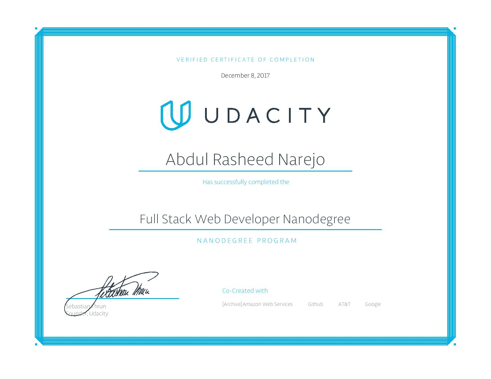

# Full Stack Web Developer Nanodegree

### About
This repository contains project work for Udacity's [Full Stack Web Developer Nanodegree](https://www.udacity.com/course/nd004) .

### Projects
- **p1** - Movie Trailer Website
- **p2** - Portfolio page
- **p3** - Log Analysis
- **p4** - Item Catalog
- **p5** - Neighborhood map
- **p6** - Linux-based Server Configuration

### Courses
- Programming Foundations with Python
- Intro to Relational Databases
- Full Stack Foundations
- Developing Scalable Apps with Python
- Linux Basics for Web Developers
